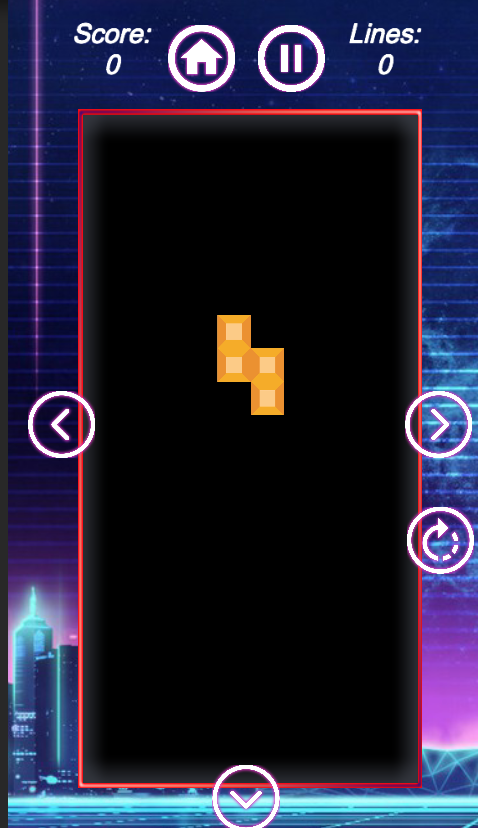

# Tetris Retro

This is the repo of my Tetris Retro game. I'll explain here how you can test it, build it or juste download the apk file.

## Prerequisites

- If you want to build and test the game yourself, you'll need one of the last version of Unity.
- This project was developped on Unity 2019.3.14f1
- It was build only for Android devices but you can build it for iOS thanks to Xcode.
- If you just want to play the game, you'll need an android device

## Getting Started

These instructions will get you a copy of the project up and running on your local machine for development and testing purposes.

### Installing

- Clone the repo
- Add the project on your Unity Hub
- Launch it

If you want to build it yourself, just change Build Settings as you want.
If you just want a direct copy of the game for android: [Click Here](http://www.mediafire.com/file/mvc0iuxak003fqe/tetris.apk/file)

## Tests

If you start the game. You should get this menu: 
 

Press play to start the game, you'll get something like this: 
 

Here you can use the buttons to move the tetramino left/right/down. There is also a specal button to rotate the tetramino.

Here is a short demo live: 
 
